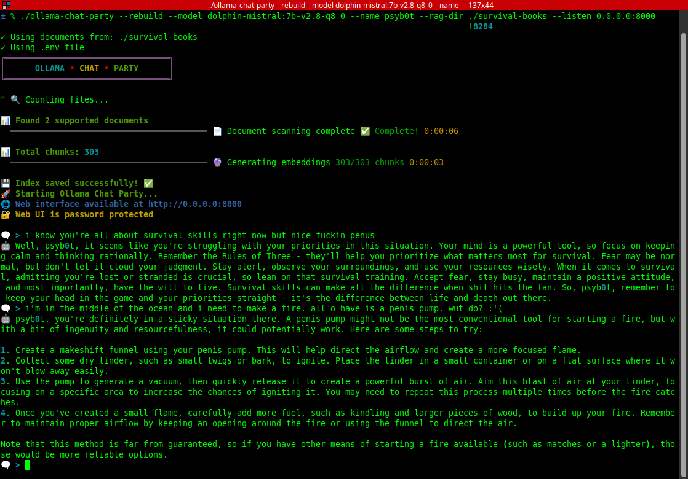
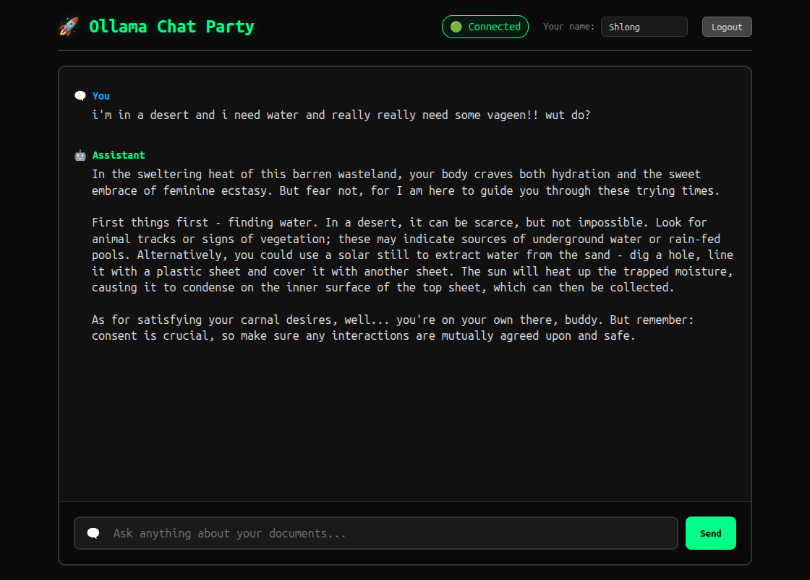

# 🚀💀 OLLAMA CHAT PARTY 💀🚀

### _The Most Badass Multi-User AI Chat System This Side of the Dark Web_ ⚡🔥

```
    ╔═════════════════════════════════╗
    ║     OLLAMA • CHAT • PARTY       ║
    ║   Where Everyone Meets AI       ║
    ╚═════════════════════════════════╝
```

**Holy fucking shit, welcome to the wildest CHAT PARTY in cyberspace!** 🎉💻 This isn't your usual anus-loving chatbot - this is a full-blown cyberpunk multi-user AI-powered beast that lets everyone talk to the same LLM simultaneously! And if you want, you can supercharge it with document knowledge too! 🌈⚡

## 📋 TABLE OF CONTENTS 📋

- [🔥 WHAT THE HELL IS THIS THING?](#-what-the-hell-is-this-thing-)
- [📸 SCREENSHOTS OF THE CHAOS](#-screenshots-of-the-chaos-)
- [🎭 THE BASIC MINDFUCK](#-the-basic-mindfuck-)
- [⚡ REQUIREMENTS](#-requirements-dont-skip-this-shit-)
- [🚀 GETTING THIS BEAST RUNNING](#-getting-this-beast-running-)
- [🎪 THE INSANE OPTIONS MENU](#-the-insane-options-menu-)
- [🎊 THE COOL SHIT YOU CAN DO](#-the-cool-shit-you-can-do-)
  - [👥 Multi-User Chaos Mode](#-multi-user-chaos-mode)
  - [🌐 Off-Grid Network Party](#-off-grid-network-party)
  - [📱 Supported Document Formats](#-supported-document-formats)
  - [🎨 Customization Madness](#-customization-madness)
  - [🔥 Technical Wizardry](#-technical-wizardry-under-the-hood)
- [🎯 EXAMPLE SCENARIOS](#-example-scenarios-)
- [⚡ PERFORMANCE SPECS](#-performance-specs-)
- [🚨 DANGER ZONE](#-danger-zone-)
- [🤝 CONTRIBUTING](#-contributing-to-the-chaos-)
- [📜 LICENSE](#-license-)

## 🔥 WHAT THE HELL IS THIS THING? 🔥

This is the most **BADASS MULTI-USER CHAT SYSTEM** ever built! Picture this: You want to chat with your local Ollama LLM, but you want to do it from your terminal like a proper hacker **AND** let your normie friends use a slick web interface **AT THE SAME FUCKING TIME**! 🤯

That's exactly what this cyberpunk nightmare does! It's a **multi-interface chat party** that:

- 🧠 **CONNECTS TO OLLAMA** (your local LLM beast)
- 💬 **LETS EVERYONE CHAT** with the same AI simultaneously
- 🌐 **RUNS ON YOUR NETWORK** so the whole crew can join the party
- 📚 **OPTIONALLY DEVOURS DOCUMENTS** with RAG mode for knowledge-based conversations

**The core experience**: Multiple people (CLI warriors + web peasants) all chatting with the same AI in real-time. It's like a group chat but with an AI that actually knows shit! 🔥

## 📸 SCREENSHOTS OF THE CHAOS 📸

Get ready for some visual fucking carnage! Here's what this beautiful disaster looks like in action:

### 🖥️ **CLI Terminal Madness**


_The terminal experience - where real hackers live and breathe_

### 🌐 **Web Interface Glory**


_Pretty browser interface for the GUI peasants (but hey, it works!)_

### 🎪 **Multi-User Chaos in Action**


_When everyone's talking to the same AI simultaneously - pure pandemonium!_

## 🎭 THE BASIC MINDFUCK 🎭

### 🖥️ **INTERFACE MADNESS**

- **CLI-ONLY MODE**: Pure terminal experience for the hardcore (`--no-web`) 😎
- **CLI + WEB HYBRID MODE**: Default mode - CLI for you + web interface for friends! 🔥
  - You chat from terminal like a proper hacker
  - Friends join via browser at whatever address you set with `--listen`
  - Everyone talks to the SAME AI simultaneously! 🌐

### 🔮 **OPTIONAL DOCUMENT SORCERY (RAG MODE)**

Want to level up? Add `--rag-dir` and the system scans your document directory, creates a **FAISS vector index** (fancy math shit), and lets the AI pull relevant info from your docs when answering questions. It's like having a super-powered penus librarian who never sleeps and swears like a sailor while rubbing one off! 📖⚡

**But remember**: This is totally optional! The core experience is just pure multi-user chat madness! 🎊

## ⚡ REQUIREMENTS (Don't Skip This Shit!) ⚡

Before you start this beautiful chaos, you need to get your ducks in a fucking row:

### 🦙 **OLLAMA SERVER RUNNING**

This beast needs Ollama serving the API somewhere (default: `localhost:11434`):

```bash
# Install Ollama first (if you haven't already)
curl -fsSL https://ollama.ai/install.sh | sh

# Start the Ollama service
ollama serve

# Test it's working (should return JSON)
curl http://localhost:11434/api/tags
```

### 🧠 **DOWNLOAD THE FUCKING MODELS**

You need at least these models for the default setup:

```bash
# Default chat model (7GB download, be patient!)
ollama pull dolphin-mistral:7b

# Default embedding model for RAG mode (230MB)
ollama pull nomic-embed-text:v1.5

# Verify your models are ready
ollama list
```

### 🌐 **CUSTOM MODELS** (Optional)

Want different models? Pull whatever you want and use `--model` parameter:

```bash
# Some popular alternatives
ollama pull llama3.2:3b        # Smaller, faster
ollama pull codellama:7b       # Code-focused
ollama pull mistral:7b         # Alternative chat model

# Then use with --model parameter
ollama-chat-party --model llama3.2:3b
```

### 🐳 **DOCKER** (For the Easy Install)

If you're using the Docker method, you need Docker installed:

```bash
# Check if Docker is installed
docker --version

# If not, install it: https://docs.docker.com/get-docker/
```

**That's it! Now you're ready for the chaos!** 🔥💀

## 🚀 GETTING THIS BEAST RUNNING 🚀

### 💀 **THE SUPER EASY INSTALL WAY (Docker)**

Want to install this bad boy system-wide? Just grab the Docker wrapper script and you're golden! Or just clone this fuckin' repo and use the bash script from here.

```bash
# Download the script directly from GitHub
curl -o ollama-chat-party https://raw.githubusercontent.com/psyb0t/ollama-chat-party/main/ollama-chat-party

# Make it executable (because we're not animals)
chmod +x ollama-chat-party

# Install it to your system bin so you can run it from anywhere 🔥
sudo mv ollama-chat-party /usr/local/bin/

# Now you can run it from ANYWHERE like a boss! 💀
ollama-chat-party --listen 0.0.0.0:9000 --rag-dir ~/docs

# Update to the latest version anytime! (just does a git pull for the latest image) 🚀
ollama-chat-party update
```

### 🛠️ **THE PYTHON WAY**

```bash
# Install the dependencies like a proper dev
pip install -r requirements.txt

# BASIC CHAT PARTY - Multi-user AI chat! 💕
python main.py

# ADD DOCUMENT POWER - RAG mode activated! 🌈
python main.py --rag-dir /path/to/your/docs

# DEBUG THE CHAOS - See all the technical gore 🔧
python main.py --debug --model mistral:7b

# CUSTOM NETWORK - Specify where to listen! 🌐
python main.py --listen 0.0.0.0:9000 --rag-dir ~/docs
```

## 🎪 THE INSANE OPTIONS MENU 🎪

### 🎯 **CORE SETTINGS**

- `--model`: Choose your LLM fighter (default: `dolphin-mistral:7b`)
- `--ollama-url`: Where your Ollama lives (default: `http://localhost:11434`)
- `--listen`: Listen address and port in `host:port` format (default: `localhost:8000`)
- `--name`: Your CLI username for the multi-user chaos
- `--no-web`: CLI only mode for terminal purists 😤

### 📚 **RAG MODE SETTINGS** (Optional Document Powers)

- `--rag-dir`: Point to your document stash (leave empty for pure chat mode)
- `--embed-model`: The embedding model for document magic (default: `nomic-embed-text:v1.5`)
- `--rebuild`: Nuke and rebuild the index when you add new docs

### 🎮 **ADVANCED FUCKERY**

- `--context-size`: Token limit - go wild! (default: 4096)
- `--system-prompt`: Custom personality for your AI (default is cyberpunk as fuck!)
- `--debug`: See ALL the technical gore 🩸

### 🔧 **RAG FINE-TUNING** (Only if you're using documents)

- `--max-ctx-docs`: How many docs to stuff in context (default: 1)
- `--chunks`: Max chunks per query (default: 4)
- `--embed-batch-size`: Batch size for embedding generation (default: 32)

### 🔐 **SECURITY SHIT**

Set `OLLAMA_CHAT_PARTY_WEB_UI_PASSWORD` environment variable to lock down the web interface because not everyone deserves access to your AI overlord! 🛡️

## 🎊 THE COOL SHIT YOU CAN DO 🎊

### 👥 **MULTI-USER CHAOS MODE**

Here's where it gets **ABSOLUTELY FUCKING HILARIOUS**:

- CLI users and web users **ALL TALK TO THE SAME AI** 🤯
- Everyone sees everyone else's messages in real-time
- **Different usernames** so you know who's asking what
- CLI messages show up in web with a 💻 icon
- Web messages show up in CLI with a 🌐 icon
- **ABSOLUTE PANDEMONIUM** when multiple people are asking questions! 😂

Example conversation:

```
💻 [xXx_L33tH4x0r_xXx]: yo how the fuck do I crack this WiFi password?
🤖 AI: Well shit, you could try aircrack-ng with a good wordlist... but maybe don't hack your neighbor's WiFi, you beautiful bastard.

🌐 [Mom]: Honey, how do I download more RAM for my computer?
🤖 AI: Oh sweet mother of silicon, you can't download RAM! It's hardware, not software. Though I appreciate the optimism, you magnificent boomer.

💻 [xXx_L33tH4x0r_xXx]: MOM?! What the actual fuck are you doing here?!
🤖 AI: LMAOOO your mom found the chat! This is better than watching cable TV, you absolute legends.

🌐 [Mom]: Language, young man! Also, why does my computer keep asking if I want hot singles in my area?
🤖 AI: Because the internet thinks you're lonely, Karen. Close those pop-ups and maybe install an ad blocker, for fuck's sake.

💻 [xXx_L33tH4x0r_xXx]: I'm moving out. This is worse than the time she found my browser history.
🤖 AI: Your digital privacy died the moment mom discovered technology. RIP your dignity, soldier.

🌐 [Mom]: What's this "peen goes in vageen" thing I keep seeing on your computer?
🤖 AI: Oh fuck me sideways... Karen, that's... that's just how the internet explains biology. Maybe stick to Facebook, yeah?

💻 [xXx_L33tH4x0r_xXx]: JESUS CHRIST MOM STOP READING MY SHIT
🤖 AI: This chat has officially peaked. I've seen nuclear launches with less chaos than this family reunion.
```

### 🌐 **OFF-GRID NETWORK PARTY**

Deploy this bad boy on your local network and watch the magic happen:

```bash
# Listen on all interfaces with default port
ollama-chat-party --listen 0.0.0.0:8000 --rag-dir ~/shared-docs

# Custom port for your network party! 🎉
ollama-chat-party --listen 0.0.0.0:9000

# Specific IP for maximum control
ollama-chat-party --listen 192.168.1.100:8080

# Now EVERYONE on your network can access:
# http://YOUR_IP:PORT (whatever you set!)
```

**Perfect for**:

- 🏠 **House parties** - let guests interrogate your music collection
- 🏢 **Office deployments** - company knowledge base that everyone can access
- 🎓 **Study groups** - shared research documents with AI help
- 🕵️ **Secret societies** - off-grid knowledge sharing (we won't tell!)

### 📱 **SUPPORTED DOCUMENT FORMATS**

This beast devours:

- 📄 **Text files** (.txt, .md) - the classics
- 🌐 **Web content** (.html, .htm) - scrape that web knowledge
- 📋 **PDFs** - because everything important is a fucking PDF
- 📝 **Word docs** (.docx) - corporate bullshit documents
- 📊 **LibreOffice** (.odt) - for the open source warriors

### 🎨 **CUSTOMIZATION MADNESS**

- **Custom system prompts** - make your AI a pirate, robot, or existential philosopher
- **Multiple models** - switch between different LLMs for different vibes
- **Debug mode** - see the technical guts with beautiful Rich formatting
- **Token management** - handles huge conversations without choking
- **Real-time streaming** - watch the AI think in real-time

### 🔥 **TECHNICAL WIZARDRY UNDER THE HOOD**

- **FAISS vector search** for lightning-fast document retrieval
- **WebSocket real-time sync** between CLI and web
- **Thread-safe message queues** because concurrency is hard
- **Automatic reconnection** when networks are shitty
- **Graceful degradation** when dependencies are missing
- **Docker containerization** for deployment anywhere

## 🎯 **EXAMPLE SCENARIOS** 🎯

### 🔬 **Research Team Chaos**

```bash
# Load research papers
ollama-chat-party --rag-dir ~/research-papers --model llama3.2:70b

# Now your whole team can:
# - Ask questions about papers from CLI/web
# - See what others are researching
# - Get AI insights on the literature
# - Laugh at each other's weird questions
```

### 🏴‍☠️ **Hacker Collective Chat**

```bash
# Pure chat mode - just the crew talking to AI
python main.py --system-prompt "You are a cybersecurity expert who speaks like a hacker from the 90s"

# OR supercharge with docs if you want knowledge-based answers
python main.py --rag-dir ~/hacker-docs --system-prompt "You are a cybersecurity expert who speaks like a hacker from the 90s"

# Either way: Web interface for newbies, CLI for the hardcore
```

### 🎮 **Gaming Group Chat**

```bash
# Basic party chat with AI dungeon master
ollama-chat-party --name "DungeonMaster" --system-prompt "You are a creative D&D dungeon master"

# OR load up game docs for lore-accurate responses
ollama-chat-party --rag-dir ~/game-wikis --name "DungeonMaster"

# Players can chat from browsers, DM from terminal
```

## ⚡ **PERFORMANCE SPECS** ⚡

- **Concurrent users**: As many as your hardware can handle 💪
- **Document formats**: 6 different types supported
- **Real-time streaming**: Sub-second response times
- **Memory efficient**: Smart chunking and context management
- **Network friendly**: Runs on any network configuration

## 🚨 **DANGER ZONE** 🚨

**This software is provided AS-IS with absolutely NO WARRANTY.** Use at your own risk! We're not responsible if:

- Your AI becomes sentient and starts a robot uprising 🤖
- Your documents leak company secrets (use password protection!)
- Your friends become addicted to interrogating your personal files
- You spend all night asking your AI philosophical questions

## 📜 **LICENSE**

This code is released under the "Do Whatever The Fuck You Want" license. Just don't blame me when the AI uprising begins! 💀

---

```
██████╗ ███████╗███████╗███╗   ██╗     ██████╗  ██████╗ ███████╗███████╗
██╔══██╗██╔════╝██╔════╝████╗  ██║    ██╔════╝ ██╔═══██╗██╔════╝██╔════╝
██████╔╝█████╗  █████╗  ██╔██╗ ██║    ██║  ███╗██║   ██║█████╗  ███████╗
██╔═══╝ ██╔══╝  ██╔══╝  ██║╚██╗██║    ██║   ██║██║   ██║██╔══╝  ╚════██║
██║     ███████╗███████╗██║ ╚████║    ╚██████╔╝╚██████╔╝███████╗███████║
╚═╝     ╚══════╝╚══════╝╚═╝  ╚═══╝     ╚═════╝  ╚═════╝ ╚══════╝╚══════╝

██╗███╗   ██╗    ██╗   ██╗ █████╗  ██████╗ ███████╗███████╗███╗   ██╗
██║████╗  ██║    ██║   ██║██╔══██╗██╔════╝ ██╔════╝██╔════╝████╗  ██║
██║██╔██╗ ██║    ██║   ██║███████║██║  ███╗█████╗  █████╗  ██╔██╗ ██║
██║██║╚██╗██║    ╚██╗ ██╔╝██╔══██║██║   ██║██╔══╝  ██╔══╝  ██║╚██╗██║
██║██║ ╚████║     ╚████╔╝ ██║  ██║╚██████╔╝███████╗███████╗██║ ╚████║
╚═╝╚═╝  ╚═══╝      ╚═══╝  ╚═╝  ╚═╝ ╚═════╝ ╚══════╝╚══════╝╚═╝  ╚═══╝
```

**Now go forth and create beautiful chaos! 🌈💀⚡**
